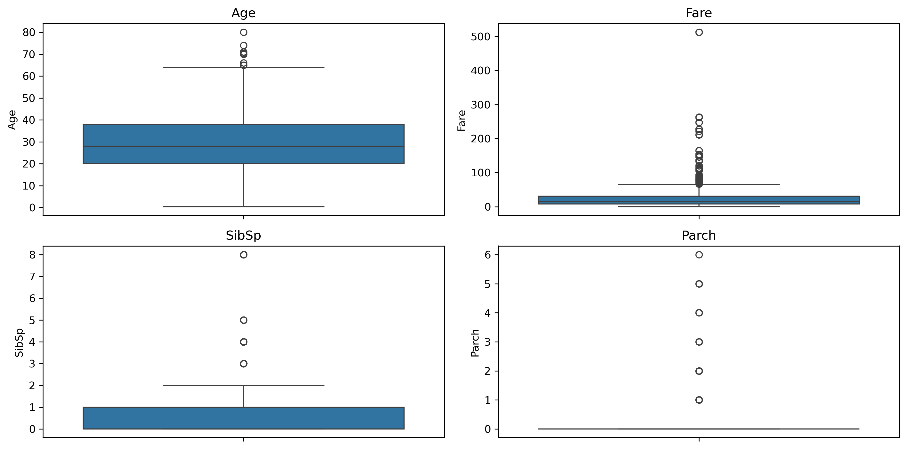
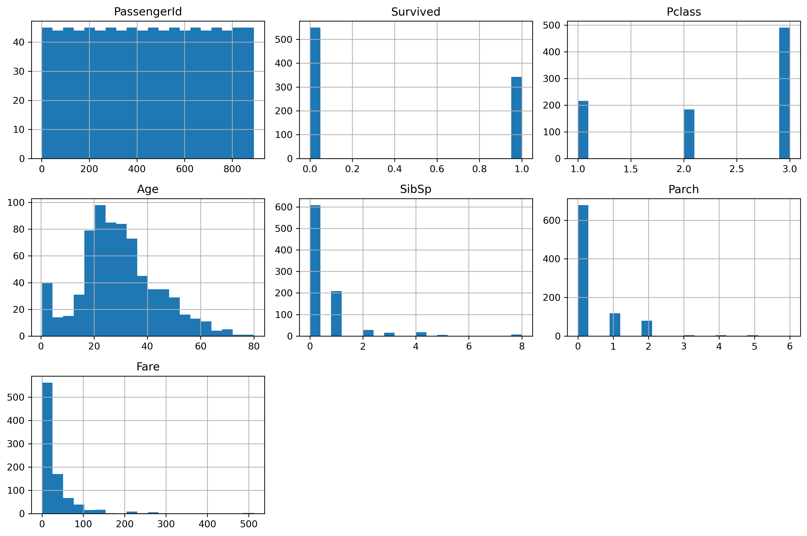

# Project 1 — Advanced Exploratory Data Analysis (EDA) & Feature Engineering

## DecodeLabs Data Science Internship

A practical data science project completed during my remote Data Science Internship at DecodeLabs.

This project focuses on exploring, cleaning, transforming, and preparing the Titanic dataset for machine learning workflows.

---

## Project Overview

The objective of this project was to perform a structured data preprocessing and exploratory analysis workflow on the Titanic dataset.

The project covers:

- Data inspection
- Missing value analysis
- Exploratory Data Analysis (EDA)
- Distribution and outlier analysis
- Correlation analysis
- Feature engineering
- Feature encoding
- Dataset preparation for machine learning

The workflow demonstrates how raw tabular data can be transformed into a cleaner and more structured dataset suitable for downstream machine learning tasks.

---

## Objectives

The main objectives of this project were to:

- Inspect the structure and characteristics of the dataset.
- Identify missing values and duplicate records.
- Analyze numerical feature distributions.
- Investigate potential outliers.
- Examine relationships between numerical variables.
- Handle missing values using appropriate strategies.
- Create meaningful features from existing variables.
- Encode categorical variables into numerical representations.
- Remove unnecessary columns.
- Export the processed dataset for future machine learning use.

---

## Dataset

The project uses the **Titanic dataset**, containing passenger-level information such as:

- Passenger class
- Survival status
- Age
- Sex
- Number of siblings/spouses
- Number of parents/children
- Fare
- Cabin
- Port of embarkation
- Passenger name and ticket information

The original dataset contains **891 rows and 12 columns**.

---

## Data Exploration

The initial analysis included:

- Dataset preview
- Dataset dimensions
- Column inspection
- Data type analysis
- Descriptive statistics
- Dataset information
- Missing value counts
- Missing value percentages
- Duplicate record detection

The analysis identified missing values primarily in:

- `Age`
- `Cabin`
- `Embarked`

No duplicate records were identified.

---

## Exploratory Data Analysis

Several visualization techniques were used to understand the numerical variables and identify patterns within the dataset.

### Boxplots

Boxplots were created for:

- Age
- Fare
- SibSp
- Parch

These visualizations were used to inspect the distributions and identify potential outliers.



---

### Numerical Feature Distributions

Histograms were generated for the numerical variables to examine their distributions and identify skewness and general patterns.



---

## Data Preprocessing

A cleaned copy of the original dataset was created before applying transformations.

### Missing Value Handling

The following approaches were applied:

- Missing `Age` values were replaced using the median age.
- Missing `Embarked` values were replaced using the mode.
- A new `Cabin_Available` feature was created to indicate whether cabin information was available.

This approach preserved useful information while reducing missing-value issues.

---

## Correlation Analysis

A correlation matrix was generated to examine relationships between numerical variables.


Some notable relationships observed during the analysis included:

- `Pclass` showed a negative relationship with `Survived`.
- `Fare` showed a positive relationship with `Survived`.
- `Cabin_Available` showed a positive relationship with `Survived`.
- `PassengerId` showed little meaningful relationship with the other variables.
- `Fare` and `Pclass` showed a moderate relationship.

---

# Feature Engineering

Three main features were created from the existing dataset.

### 1. FamilySize

`FamilySize` combines the number of siblings/spouses and parents/children traveling with the passenger.

```text
FamilySize = SibSp + Parch + 1
