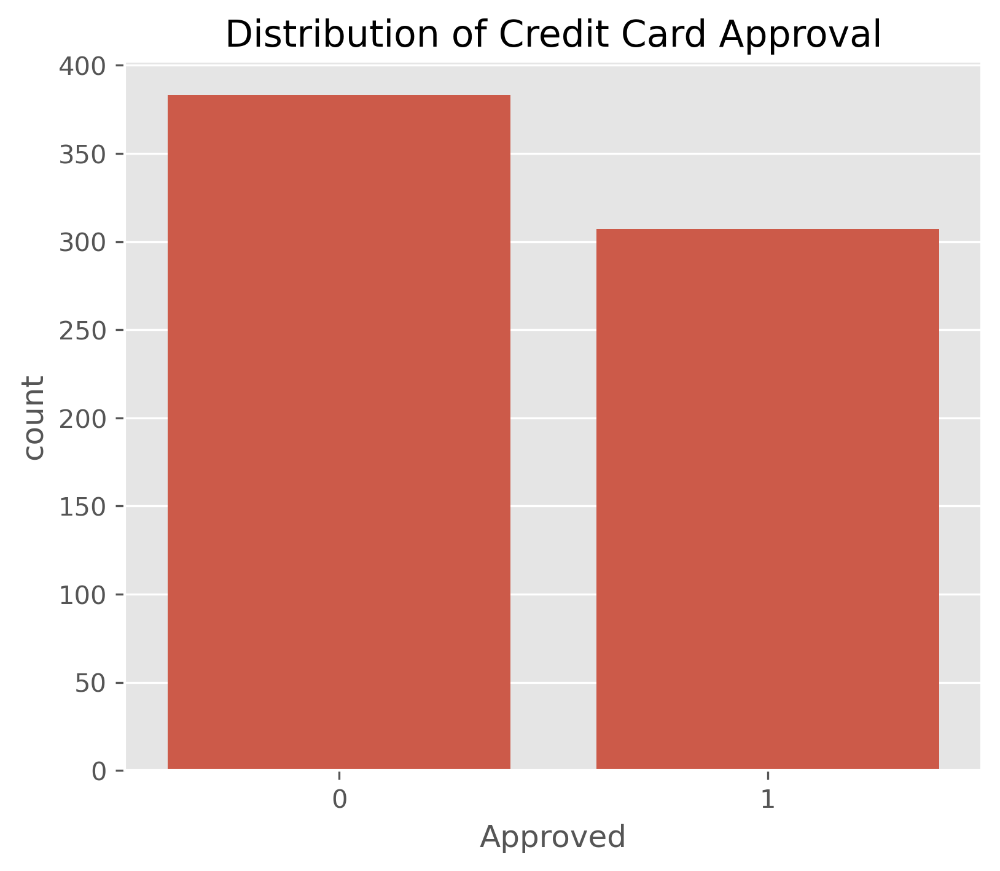
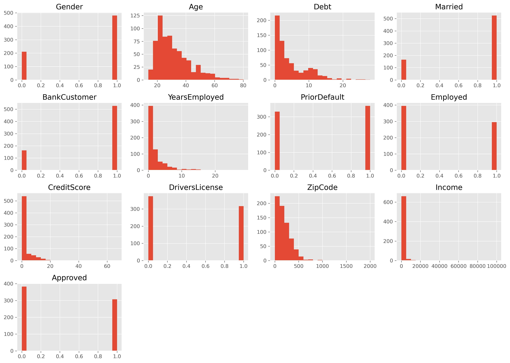
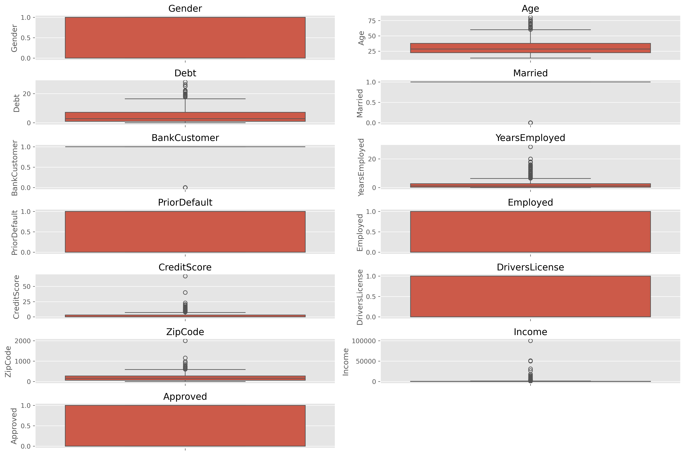
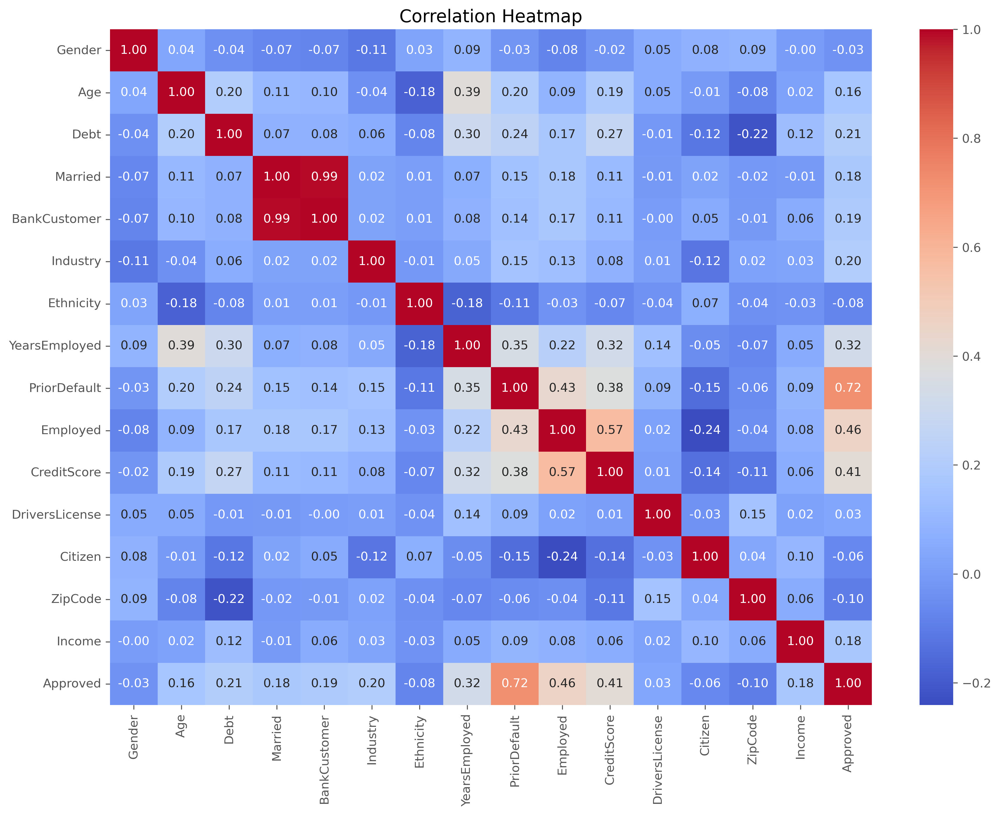
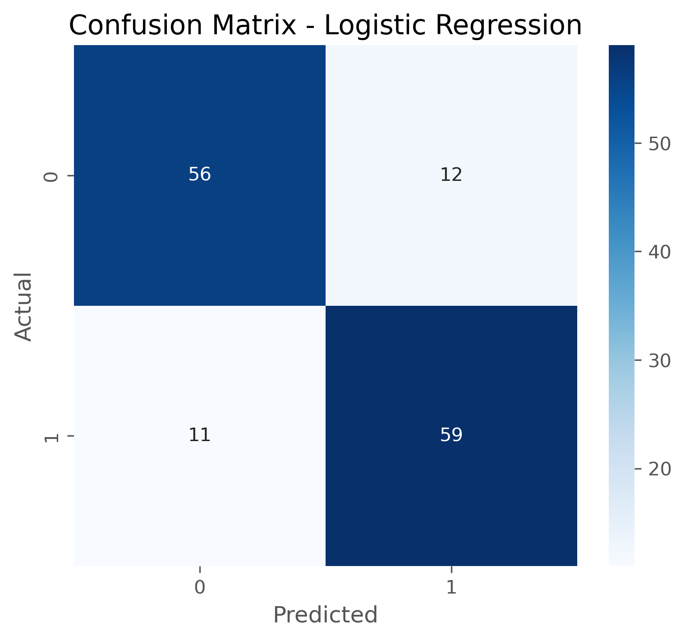
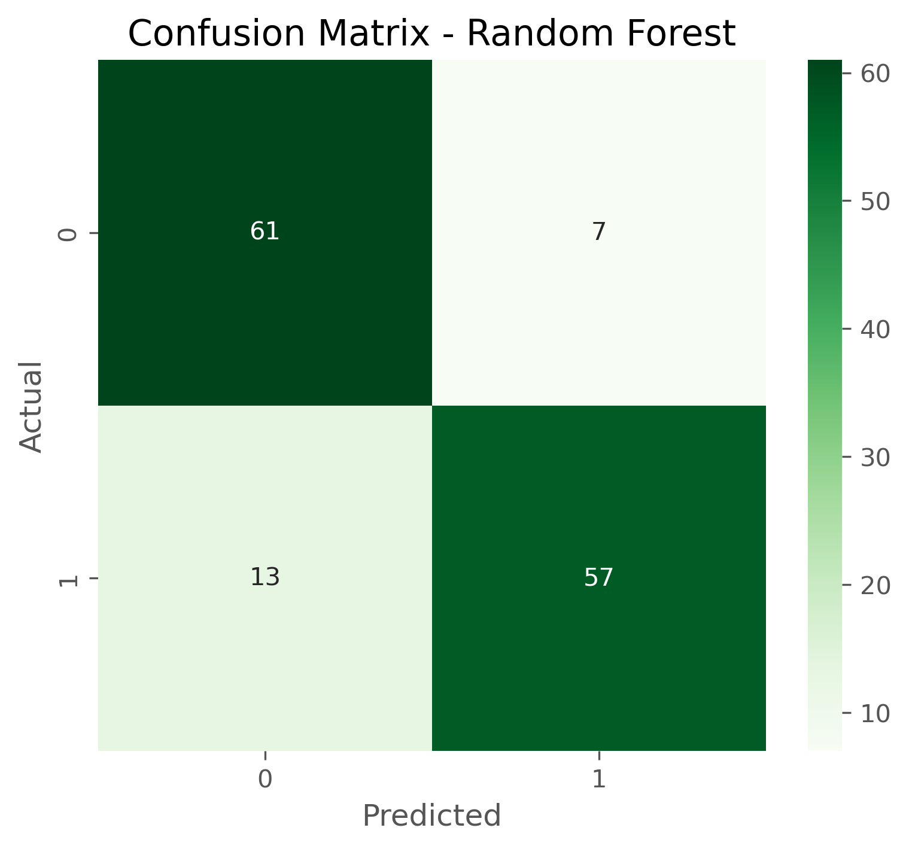
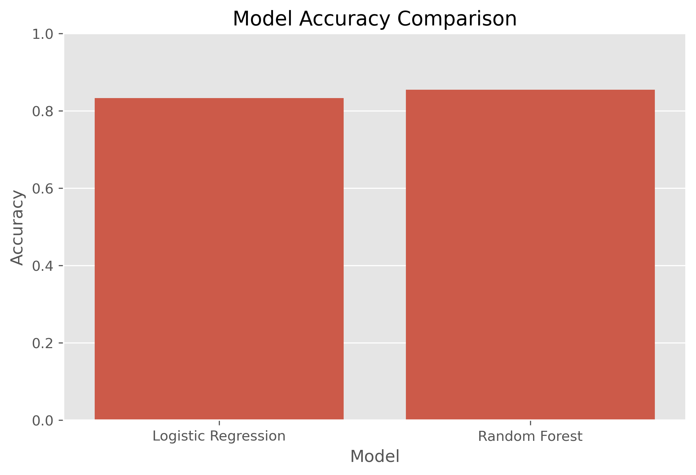

# Project 2 — Credit Card Approval Prediction

## DecodeLabs Data Science Internship

A supervised machine learning project completed during my remote Data Science Internship at DecodeLabs.

This project focuses on predicting whether a credit card application should be approved based on applicant information using classification algorithms.

---

## Project Overview

The project follows a complete supervised machine learning workflow, including:

- Data loading and inspection
- Exploratory Data Analysis (EDA)
- Target variable analysis
- Numerical feature visualization
- Outlier analysis
- Correlation analysis
- Feature encoding
- Feature and target separation
- Train-test splitting
- Feature scaling
- Logistic Regression
- Random Forest
- Model evaluation
- Prediction results generation
- Model comparison

The objective is to develop classification models and compare their performance on unseen test data.

---

## Dataset

The project uses a credit card approval dataset containing applicant-related attributes such as:

- Gender
- Age
- Debt
- Marital Status
- Bank Customer
- Industry
- Ethnicity
- Years Employed
- Prior Default
- Employment Status
- Credit Score
- Driver's License
- Citizenship
- Zip Code
- Income
- Approved

The target variable is:

**Approved**

---

## Exploratory Data Analysis

Several exploratory analysis techniques were applied to understand the dataset before model development.

### Target Variable Distribution

The distribution of credit card approval outcomes was visualized to understand the target classes.



### Numerical Feature Histograms

Histograms were created to examine the distribution and spread of numerical variables.



### Outlier Analysis

Boxplots were generated to identify potential outliers within numerical features.



### Correlation Analysis

A correlation heatmap was generated to examine relationships between numerical variables.



---

## Data Preprocessing

The following preprocessing steps were performed:

### Missing Value Analysis

The dataset was checked for missing values before further preprocessing.

### Feature Encoding

Categorical variables were converted into numerical representations using Label Encoding.

### Feature and Target Separation

The dataset was separated into:

- **X:** Input features
- **y:** Target variable (`Approved`)

### Train-Test Split

The dataset was divided into training and testing sets using an 80:20 split.

Stratified splitting was applied to maintain a similar distribution of the target classes in both datasets.

### Feature Scaling

Numerical features were standardized using `StandardScaler`.

The scaler was fitted only on the training data and then used to transform the test data, preventing information from the test set from influencing the scaling process.

---

## Machine Learning Models

Two classification algorithms were developed and evaluated.

### 1. Logistic Regression

Logistic Regression was used as a baseline classification model for predicting the approval outcome.

### 2. Random Forest

Random Forest was implemented as a tree-based ensemble classification model and compared with Logistic Regression.

---

## Model Evaluation

The models were evaluated using:

- Accuracy
- Precision
- Recall
- F1 Score

Confusion matrices were also generated to examine classification performance.

### Logistic Regression Confusion Matrix



### Random Forest Confusion Matrix



---

## Model Comparison

The performance of Logistic Regression and Random Forest was compared using the calculated evaluation metrics.



The complete comparison results are available in:

`model_comparison_results.csv`

---

## Prediction Results

Predictions generated on the test dataset are stored in:

`prediction_results.csv`

The file contains the actual and predicted outcomes used for evaluating model performance.

---

## Technologies Used

- Python
- Pandas
- NumPy
- Matplotlib
- Seaborn
- Scikit-learn
- Jupyter Notebook

---

## Project Structure

```text
Project_02_Credit_Card_Approval/
│
├── Project_02_Credit_Card_Approval.ipynb
├── credit_card.csv
│
├── target_distribution.png
├── numerical_histograms.png
├── boxplots.png
├── correlation_heatmap.png
│
├── logistic_confusion_matrix.png
├── random_forest_confusion_matrix.png
├── model_comparison.png
│
├── model_comparison_results.csv
├── prediction_results.csv
│
└── README.md
