# Project 3 — Customer Segmentation

## DecodeLabs Data Science Internship

### Project Overview

This project focuses on customer segmentation using unsupervised machine learning techniques.

The objective is to discover meaningful customer segments from customer demographic, purchasing, engagement, and marketing campaign data. The project follows a complete data science workflow, from data cleaning and feature engineering to clustering, dimensionality reduction, cluster evaluation, and business-oriented interpretation.

The analysis uses K-Means clustering to identify distinct customer behavior patterns and translates the resulting clusters into actionable customer profiles.

---

## Objective

The main objectives of this project were to:

- Explore customer demographic and behavioral data.
- Clean and transform the dataset for analysis.
- Create meaningful customer-level features.
- Select relevant variables for segmentation.
- Standardize numerical features before clustering.
- Apply K-Means clustering.
- Use the Elbow Method to evaluate candidate cluster counts.
- Use Silhouette Scores to assess cluster quality.
- Apply Principal Component Analysis (PCA) for dimensionality reduction and visualization.
- Profile the resulting customer segments.
- Translate the clusters into business-oriented customer personas and strategies.

---

## Dataset

The project uses customer marketing and purchasing data containing demographic information, purchasing behavior, website engagement, and campaign-response variables.

The original dataset contains **2,240 customer records and 29 variables**.

Important categories of information include:

- Customer demographics
- Education and marital status
- Income
- Recency
- Product spending
- Purchase frequency
- Web, catalog, and store purchases
- Website visits
- Marketing campaign responses

---

## Project Workflow

The project follows these major stages:

1. Import required libraries
2. Load and inspect the dataset
3. Exploratory Data Analysis
4. Data cleaning and feature engineering
5. Feature selection and preprocessing
6. Feature standardization
7. Elbow Method analysis
8. Silhouette Score analysis
9. K-Means clustering
10. Cluster profiling
11. Customer segment visualization
12. Business interpretation and customer personas

---

## 1. Data Exploration

The dataset was inspected to understand:

- Dataset dimensions
- Column names
- Data types
- Numerical variables
- Categorical variables
- Missing values
- Customer demographic characteristics
- Purchasing behavior
- Marketing campaign responses

Exploratory analysis was also used to identify skewed variables, unusual observations, and relationships between customer features.

---

## 2. Data Cleaning and Feature Engineering

A separate working copy of the original dataset was created to preserve the raw data during analysis.

The preprocessing workflow included:

- Handling missing values in the `Income` variable.
- Converting the customer date variable into a usable datetime format.
- Creating demographic features.
- Creating purchasing and spending features.
- Aggregating purchasing behavior.
- Creating campaign-related features.
- Removing identifiers and constant variables that were not useful for clustering.

The resulting dataset was transformed into a numerical feature matrix suitable for distance-based clustering algorithms.

---

## 3. Feature Selection

Twelve features were selected for customer segmentation:

- `Age`
- `Income`
- `Total_Children`
- `Recency`
- `Total_Spending`
- `Total_Purchases`
- `NumDealsPurchases`
- `NumWebPurchases`
- `NumCatalogPurchases`
- `NumStorePurchases`
- `NumWebVisitsMonth`
- `Total_Campaign_Acceptance`

These variables represent customer demographics, purchasing behavior, engagement, and campaign acceptance.

The final clustering feature matrix contains **2,240 customers and 12 features**.

---

## 4. Feature Standardization

Because K-Means clustering is distance-based, the selected numerical features were standardized before clustering.

`StandardScaler` was used to place the features on a comparable scale so that variables with larger numerical ranges would not dominate the clustering process.

---

## 5. Elbow Method

The Elbow Method was used to evaluate different values of K by examining within-cluster variation.

The analysis considered multiple possible numbers of clusters and examined the reduction in within-cluster sum of squares (WCSS).

The Elbow Method was considered together with the Silhouette Score when selecting the final clustering configuration.

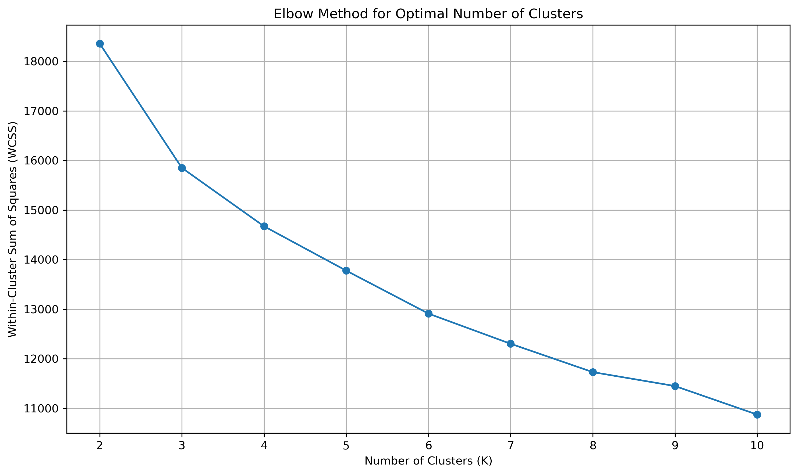

---

## 6. Silhouette Score Analysis

Silhouette Scores were calculated for cluster counts from 2 through 10.

The scores obtained were:

| Number of Clusters | Silhouette Score |
|---:|---:|
| 2 | 0.304260 |
| 3 | 0.256991 |
| 4 | 0.258842 |
| 5 | 0.169852 |
| 6 | 0.163097 |
| 7 | 0.165670 |
| 8 | 0.166621 |
| 9 | 0.144618 |
| 10 | 0.146139 |

The highest Silhouette Score was obtained with **2 clusters**, supporting the selection of two customer segments.

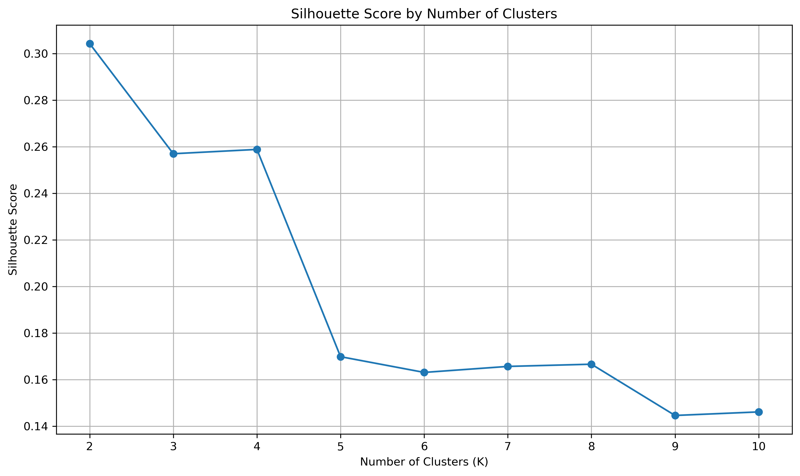

---

## 7. K-Means Clustering

K-Means clustering was applied to the standardized customer feature matrix.

The final configuration produced two customer segments:

- **Cluster 0:** 1,194 customers
- **Cluster 1:** 1,046 customers

The cluster labels were added back to a copy of the original dataset for further profiling and analysis.

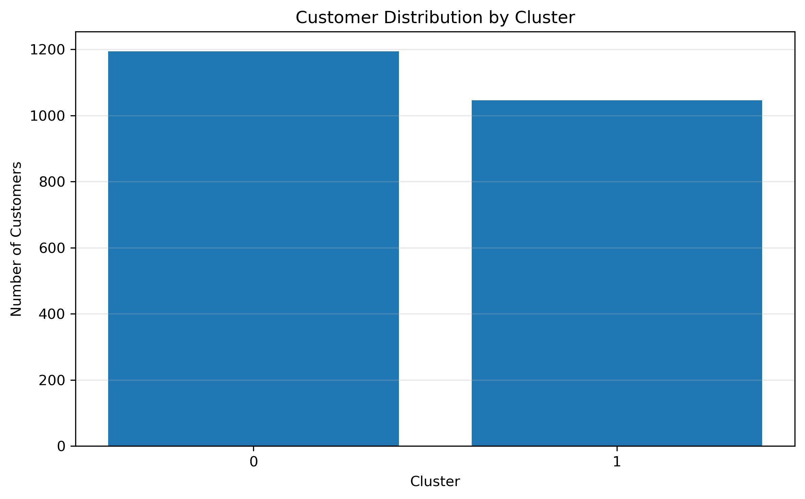

---

## 8. Cluster Profiling

The customer segments were profiled using demographic, spending, purchasing, website engagement, and marketing campaign variables.

### Cluster 0 — Lower-Value / Less Active Customers

Cluster 0 contains customers with:

- Lower average income
- Lower purchasing activity
- Lower overall spending
- Lower spending across product categories
- Fewer purchases across major purchasing channels
- Relatively higher monthly website visits
- Lower campaign response levels

### Cluster 1 — Higher-Value / Highly Active Customers

Cluster 1 contains customers with:

- Higher average income
- Higher overall spending
- Higher purchasing activity
- Stronger purchasing activity across web, catalog, and store channels
- Stronger responses to previous marketing campaigns
- Higher customer value

Recency is relatively similar between the two clusters, indicating that the main differences are related more strongly to customer value, purchasing behavior, and campaign responsiveness.

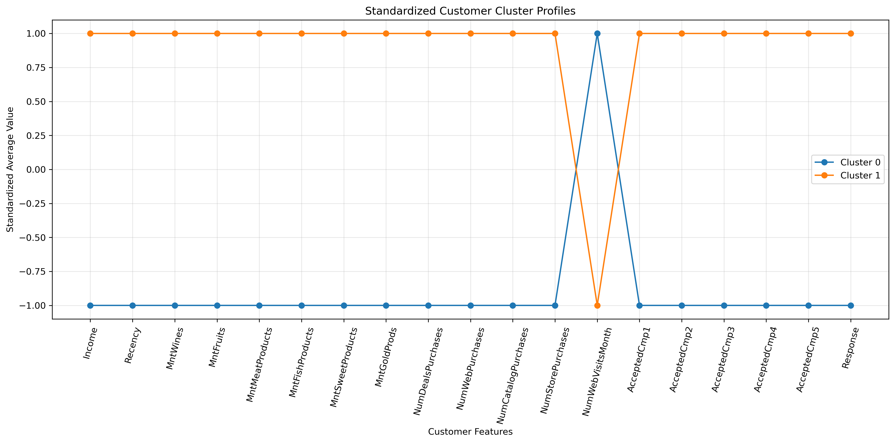

---

## 9. Customer Segment Visualization

Principal Component Analysis (PCA) was used to reduce the standardized feature space to two principal components for visualization.

The resulting visualization provides a two-dimensional representation of the customer segments generated by K-Means.

Some overlap between clusters is expected because PCA compresses the original feature space into two dimensions.

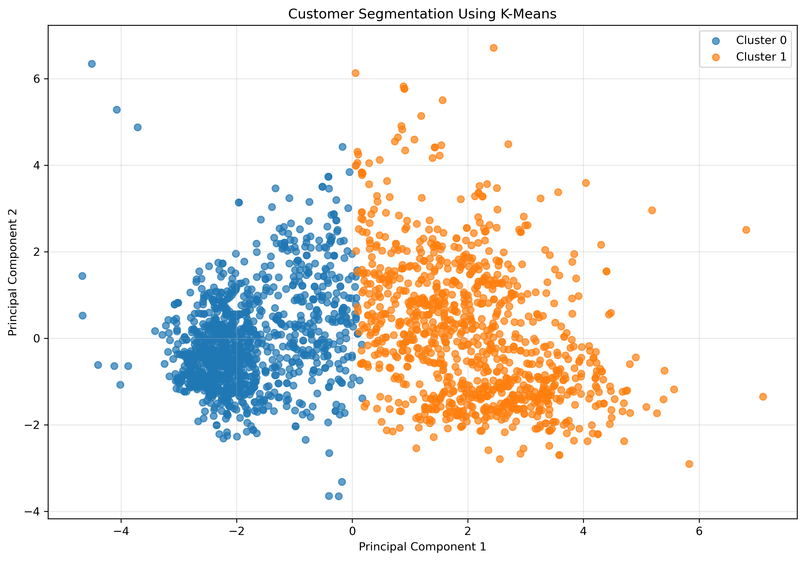

---

## 10. Customer Behavior Visualizations

Additional visualizations were created to understand the characteristics of the customer segments.

### Income and Spending

Income was compared with total product spending to examine differences in customer value between clusters.

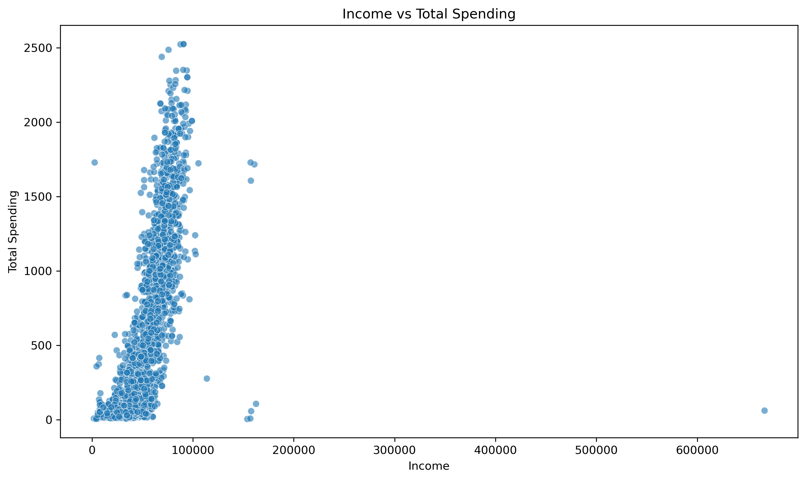

### Income and Spending by Cluster

Customer income and total spending were visualized while distinguishing customers according to their assigned cluster.

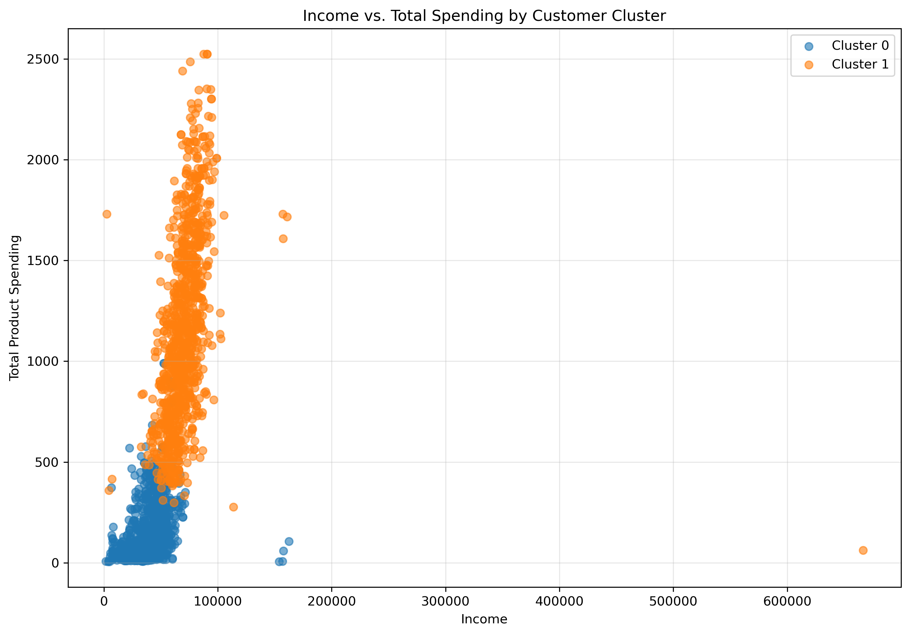

### Purchase Behavior

Average purchasing behavior was compared across customer segments and purchasing channels.

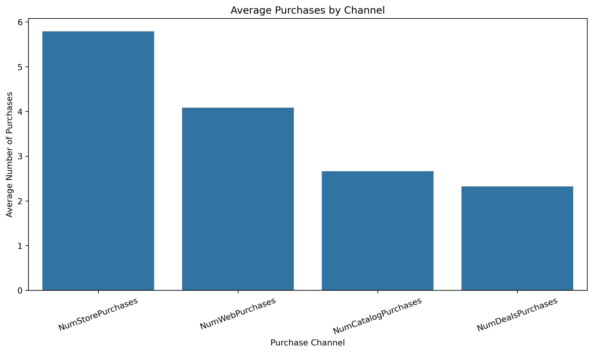

### Feature Distributions

Customer feature distributions were examined to understand the spread and characteristics of important variables.

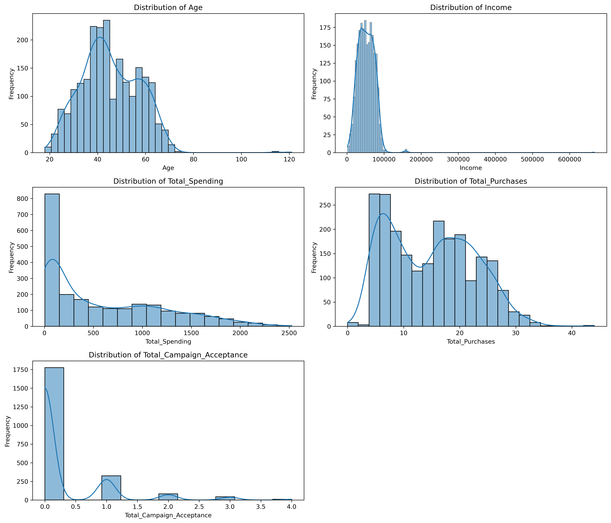

### Feature Boxplots

Boxplots were used to examine the distribution and potential extreme observations within customer features.

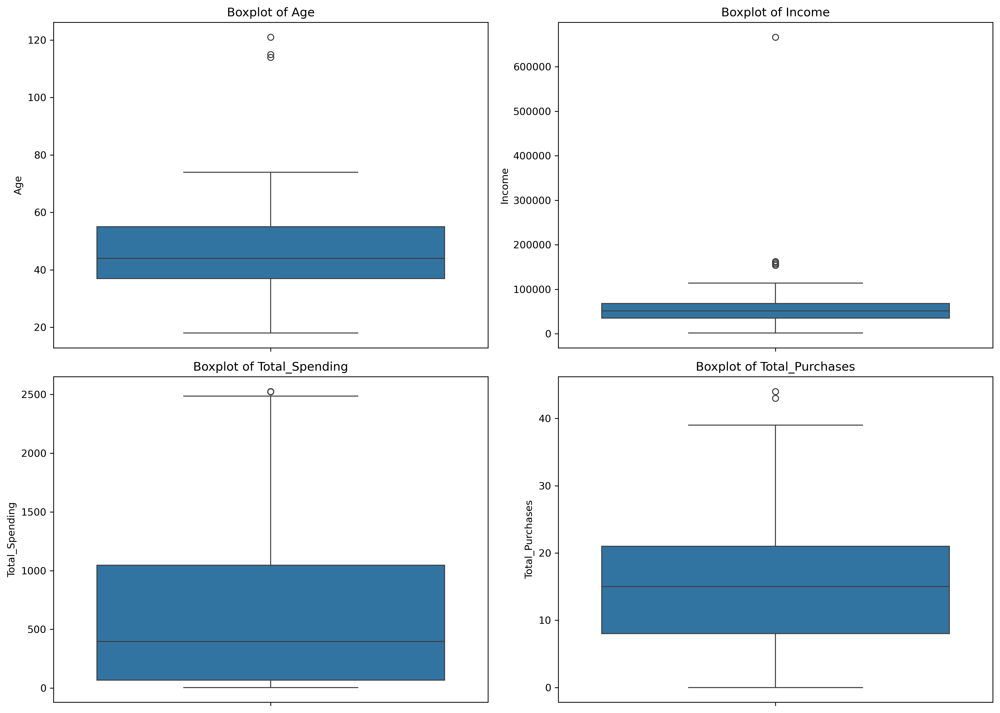

### Correlation Analysis

A correlation heatmap was generated to examine relationships between numerical customer features.

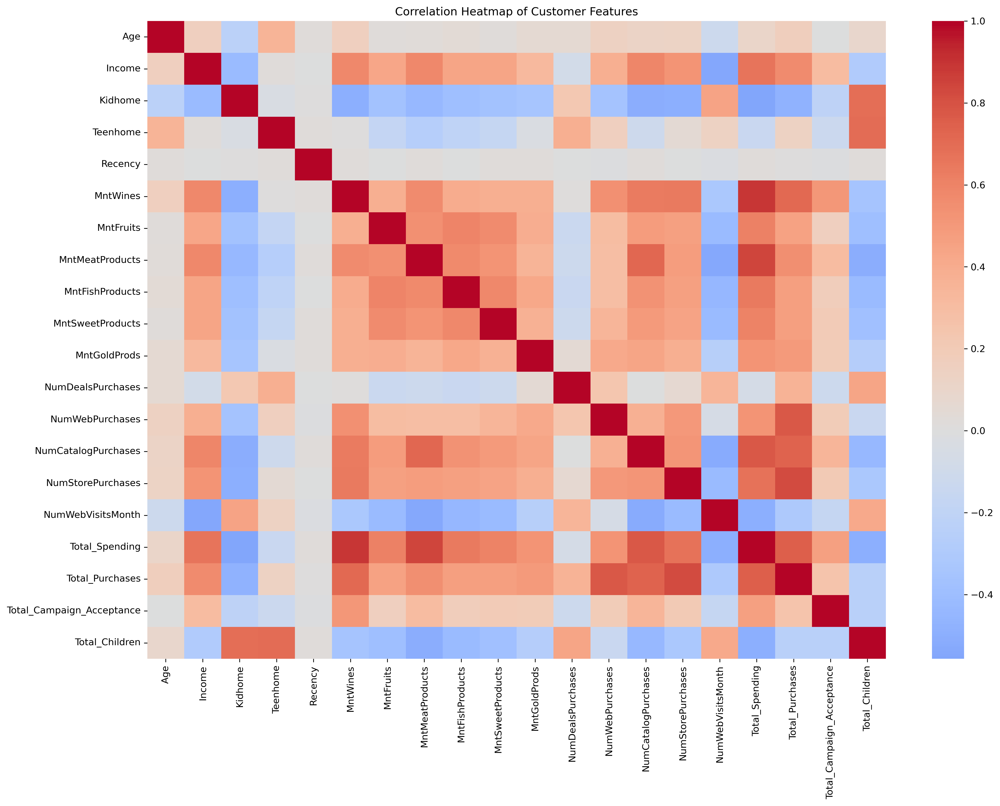

### Standardization Comparison

Feature distributions were compared before and after standardization.

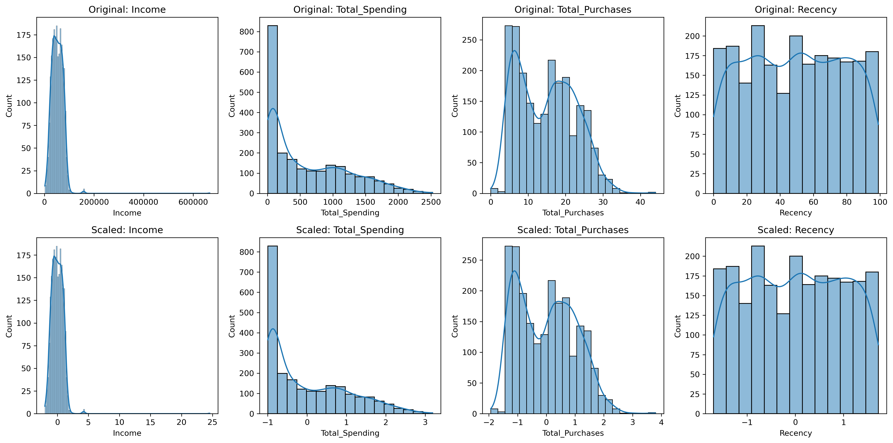

---

## 11. Business Interpretation

The clustering results were translated into two broad customer profiles.

| Segment | Profile | Recommended Strategy |
|---|---|---|
| Cluster 0 | Lower-value / less active customers | Conversion-focused offers and personalized promotions |
| Cluster 1 | Higher-value / highly active customers | Retention, loyalty, and premium customer strategies |

The segmentation provides a structured way to differentiate customer groups according to their value, purchasing behavior, engagement, and campaign responsiveness.

---

## 12. Project Outputs

The project produces the following analysis outputs:

- `elbow_method.png`
- `silhouette_scores.png`
- `cluster_distribution.png`
- `cluster_size_analysis.png`
- `cluster_profile_comparison.png`
- `customer_correlation_heatmap.png`
- `customer_feature_boxplots.png`
- `customer_feature_distributions.png`
- `before_after_standardization.png`
- `income_vs_spending_clusters.png`
- `income_vs_total_spending.png`
- `average_purchases_by_channel.png`
- `final_customer_segments.png`
- `customer_segmented.csv`

The `customer_segmented.csv` file contains the customer data with the generated cluster assignments.

---

## Tools and Technologies

- Python
- Pandas
- NumPy
- Matplotlib
- Seaborn
- Scikit-learn
- Jupyter Notebook
- K-Means Clustering
- Principal Component Analysis (PCA)
- StandardScaler
- Silhouette Score

---

## Key Skills Demonstrated

- Exploratory Data Analysis
- Data Cleaning
- Feature Engineering
- Feature Selection
- Data Standardization
- Unsupervised Machine Learning
- K-Means Clustering
- Dimensionality Reduction
- PCA
- Cluster Evaluation
- Customer Profiling
- Data Visualization
- Business-Oriented Data Interpretation

---

## Internship Context

This project was completed as part of the **DecodeLabs Data Science Internship** and represents an application of unsupervised learning techniques to customer analytics and segmentation.

---

## Repository Structure

```text
Project_03_Customer_Segmentation/
│
├── Project_03_Customer_Segmentation.ipynb
├── marketing_campaign.csv
├── customer_segmented.csv
│
├── average_purchases_by_channel.png
├── before_after_standardization.png
├── cluster_distribution.png
├── cluster_size_analysis.png
├── cluster_profile_comparison.png
├── customer_correlation_heatmap.png
├── customer_feature_boxplots.png
├── customer_feature_distributions.png
├── elbow_method.png
├── final_customer_segments.png
├── income_vs_spending_clusters.png
├── income_vs_total_spending.png
└── silhouette_scores.png
```

---

## Conclusion

This project demonstrates a complete customer segmentation workflow using unsupervised machine learning.

The analysis transformed raw customer data into meaningful behavioral features, standardized the selected variables, evaluated different clustering configurations, and applied K-Means to identify two customer segments.

The resulting segments show clear differences in customer value, spending, purchasing activity, website engagement, and marketing campaign responsiveness. The final analysis translates these statistical patterns into practical customer profiles that can support differentiated marketing and customer-retention strategies.
